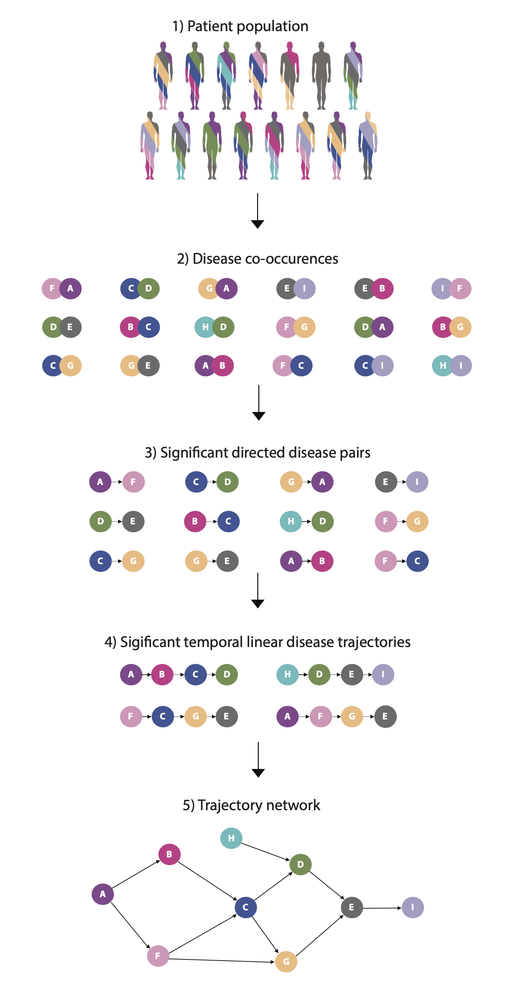

```{r setup, include=FALSE}
install.packages("rmarkdown")
library(rmarkdown)
knitr::opts_chunk$set(echo = TRUE)
```

# Introduction

In this workshop you will to use R markdown and the Disease Trajectory Browser to investigate data from the National Patient Registry. You will try to visualize common disease trajectories from the Danish population.

### Learning Objectives

1)  Get familiar with registry-like data and ICD-10 structure and codes
2)  Understand the concept of disease trajectories
3)  Try different ways of visualizing disease trajectories
4)  Have fun 🥳

### Agenda for today

-   **Investigating registry-like data**
-   Disease pairs, linear age plot and sankey network visualization
-   Disease trajectories associated to survival using Sankey
-   Danish Disease Trajectory Browser

### The programming language R

If you are not familiar with R and need help to understand what a function does, which variables you can modify etc., you can always use the questionmark to open a help page. For example does this show how the library command works. Click 'on the small green arrow' to run the code and see the output.

```{r, eval=T}
?library
```

For this command the output is shown in the lower, right corner.

For some of the code you will need to install the tidyverse, dplyr, networkD3 and alluvial packages.

```{r, echo=TRUE, message=FALSE, results='hide', eval =FALSE, warning=FALSE}
install.packages("tidyverse")
library(tidyverse)
install.packages("dplyr")
library(dplyr)
install.packages("ggplot2")
library(ggplot2)
install.packages("networkD3")
library(networkD3)
install.packages("alluvial")
library(alluvial)
```

### Investigating registry-like data:

## 1) LOAD THE DATA FILES INTO R

We have created a simulated data set that is similar to registry type data. There are two files from the registry:

-   A cpr-file *cpr.tsv* that contains: patient information.
-   A lpr-file *lpr.tsv* that contains: information about the patients' stay at the hospital.

Read the two files into R. You can use the read.csv command. This will read and save the files as a data frame. A data frame has the variables of a data set as columns and the observations as rows. It is specified that the file has a header and that the columns are split by tabs.

```{r}
cpr <- read.csv('cpr.tsv', header = T, sep = '\t')

lpr <- read.csv('lpr.tsv', header = T, sep ='\t')

```

## 2) TAKE A LOOK AT THE DATA

Take a look at the files and try to understand the files.

**Q: What columns do each of the files contain?**

HINT: The "head" command shows the first lines of the files.

```{r}
# Type your own commands to see what each of the files contain here: 


```

**Q: Which column do you think contains the diagnoses of the patients?**

**Q: How big are the files/How many lines do they contain?**

HINT: The "dim" command shows the dimensions of the files.

```{r, eval=F}
# Type your own commands to see the dimentions of the files here: 


```

**Q: What is the ICD-10 code for pancreatic cancer?** (HINT: look it up online, remember there's a small difference between the Danish and international versions of ICD-10)

**Q: How many times is pancreatic cancer diagnosed in the registry??**

(HINT: replace "ICD10" with the code you found for pancreatic cancer.)

```{r}
sum(lpr$CODE == "ICD10")
```

You are now done with the first initial look at the registry-like data. This type of data have been used to create disease trajectories for the Danish population. You can wait till all are done with this part and we move on with the disease trajectory 'lecture' or you can slowly start to read about disease trajectories yourself (see below).

## Disease pairs, linear age plot and Sankey network visualization

### The theory behind creating Disease trajectories

A disease co-occurrence algorithm was developed to investigate comorbidities and longer, temporal disease trajectories in the Danish population (Jensen et al., 2014). The key steps in the algorithm is seen on the figure below.

1)  Different colors of the patients illustrate different comorbidities and each color corresponds to a specific chapter in the ICD-10 terminology (step 1 in Figure).

2)  All possible combinations of disease co-occurrences (D1 with D2) in the population are tested to find diseases that co-occur significantly more often together compared to their individual frequencies (step 2 in Figure 1). The relative risk (RR) is used to evaluate the strength of the correlation between disease co-occurrences. Comparison groups of N =10,000 random patients are matched on birth decade, sex, type of hospital encounter and discharge week. Occurrences of D2 in this matched comparison group were calculated and show how prevalent the co-occurrence of D1 and D2 are in the general population. P-values for each RR were found using a binomial distribution. All disease pairs (D1 and D2) with an RR \> 1 and p-value \< 0.001 were included as significant disease co-occurrences.

3)  All significant disease co-occurrences were tested for directionality with binomial tests to identify pairs where significantly more patients had D1 diagnosed before D2 or the other way around (Figure, step 3). P-values were corrected for multiple testing using Bonferroni correction and found significant if the corrected p-value \< 0.05.

4)  Significant directed disease pairs are combined into longer trajectories of overlapping diagnoses (Figure, step 4). Typically, we required that at least 20 patients follow the entire trajectory, thus in this case, have all four diagnoses (D1-\> D2 -\> D3 -\> D4) in the order specified by the trajectory.

5)  Numerous disease trajectories can be visualized as a disease progression network with edges linking directed disease pairs, showing how frequent alternative disease paths are followed over time (Figure, step 5).

{width="700"}

For more detail about the disease trajectory method see;

Jensen, A.B., Moseley, P., Oprea, T., Ellesoe, S.G., Eriksson, R., Schmock, H., Jensen, P.B., Jensen, L.J., Brunak, S. Temporal disease trajectories condensed from population-wide registry data covering 6.2 million patients. Nat Commun 5, 4022 (2014). <https://doi.org/10.1038/ncomms5022>

Siggaard, T., Reguant, R., Jørgensen, I.F., Haue, A.D., Lademann, M., Aguayo-Orozco, A., Hjaltelin, J.X., Jensen A.B., Banasik, K., Brunak, S. Disease trajectory browser for exploring temporal, population-wide disease progression patterns in 7.2 million Danish patients. Nat Commun 11, 4952 (2020). <https://doi.org/10.1038/s41467-020-18682-4>

## 3) TIME TO LOOK AT DISEASE PAIRS AND TRAJECTORIES

We have cheated a little and prepared disease trajectories in advance (as it would take to long for you to do it during this workshop). We created two files;

-   A pairs-file *pairs.tsv* that contains: pairs of disease co-occurrences in the National Patient Registry
-   A trj-file *trj.tsv* that contains: disease trajectories with 3 consecutive disease for pancreatic cancer

Read the two files into R. You can use the read.csv command. This will read and save the files as a data frame. A data frame has the variables of a data set as columns and the observations as rows. It is specified that the file has a header and that the columns are split by tabs.

```{r}
pairs = read.csv("pairs.tsv", header = T, sep = "\t")
trj = read.csv("trj.tsv", header = T, sep = "\t")
```

Take a look at the files and try to understand the files.

**Q: What columns do each of the files contain?**

```{r}
# Type your own commands to see what each of the files contain here: 
head(trj)
head(pairs)

```

We will start out with visualizing the disease pairs, hence all of the diseases that co-occur more together than expected based on the individual frequencies.

First you should filter the pairs file so it only includes pairs including the diagnosis of pancreatic cancer.

```{r}
pairs[which(pairs$D1 == "C25" | pairs$D2 == "C25"),]
pairs = pairs[which(pairs$D1 == "C25" | pairs$D2 == "C25"),]
```

Then we will plot the pancreatic cancer disease pairs and the mean age for diagnosis for each of them. AGE_AT_D1 is the mean age at the first diagnosis and CODE_DIFF_DAYS is the difference in days between the two diagnoses.

```{r}
# define colors of ICD-10 chapters
colorCodes = c(A = "#2FCFD3", C="#9E4F46", D = "#F69EDC", E= "#FF1AB9", F = "#2DC92D", G = "#004DE6", K = "#008495")


## Color look up:
pairs$col1 = as.matrix(colorCodes[substr(pairs$D1,1,1)])
pairs$col2 = as.matrix(colorCodes[substr(pairs$D2,1,1)])

# create name for each trajectory and order file according to age at diagnose
pairs$name = paste(pairs$D1, pairs$D2, sep = "_")
pairs$name = factor(pairs$name, levels = pairs$name[order(pairs$AGE_AT_D1)])

# create plot
install.packages("ggplot2")
library(ggplot2)
ggplot(data=pairs, aes()) +
  geom_segment(aes(x=(AGE_AT_D1/365.25), xend=((AGE_AT_D1+CODE_DIFF_DAYS)/365.25),y=name, yend =name), size = pairs$counts/200, alpha=.7, col="grey") +
  geom_point(aes(x=(AGE_AT_D1/365.25), y=name,colour=col1), size =8, alpha=1) + 
  geom_text(aes(x=(AGE_AT_D1/365.25), y=name,label=D1),size=2, colour="white") +
  geom_point(aes(x=((AGE_AT_D1+CODE_DIFF_DAYS)/365.25), y=name, colour=col2),size =8, alpha=1) + 
  geom_text(aes(x=((AGE_AT_D1+CODE_DIFF_DAYS)/365.25), y=name, label=D2),size=2,colour="white") +
  scale_colour_identity() + theme(text = element_text(size = 12)) + theme_minimal() +
  xlab("Age at first diagnosis") + ylab(" ") + 
  ggtitle("Pancreatic cancer disease pairs") + 
  theme(plot.title = element_text(color="black", size=12),
        axis.ticks.y = element_blank())
```

**Q: Which disease pairs have the oldest and the youngest mean age for the diagnosis of pancreatic cancer?**

You will now try to visualize the disease pairs in one type of Sankey diagram.

```{r}
# load relevant packages
library(tidyverse)
library(networkD3)

# create nodes from the two diseases:
nodes = data.frame(names=c(as.character(pairs$D1), as.character(pairs$D2)) %>% unique())

# define source and target:
pairs$IDsource = match(pairs$D1, nodes$names)-1
pairs$IDtarget = match(pairs$D2, nodes$names)-1            

nodes$group = as.factor(substr(nodes$names, 0,1))

# define colors
my_color = 'd3.scaleOrdinal() .domain(["A", "C", "D", "E", "F", "G", "K"])
.range(["#2FCFD3", "#9E4F46", "#F69EDC", "#FF1AB9", "#2DC92D", "#004DE6", "#008495"])'

# create sankey network:
sankeyNetwork(Links = pairs, Nodes = nodes, Source ="IDsource", Target = "IDtarget", Value = "counts", NodeID = "names", 
  sinksRight =T, fontSize =0, fontFamily=NULL, nodeWidth = 10, nodePadding = 5, margin = NULL, height = 300, width=600, iterations= 32, colourScale=my_color, NodeGroup="group") 
```

**Q: You can try to change some of the variables in the creation of the Sankey, the colors, or just drag the nodes around to optimize the network**

## Disease trajectories associated to survival using Sankey

The trj.tsv file contains temporal disease trajectories that each of the patients follow. Each trajectory in the file consists of 3 different diseases. We would like to visualize the different steps in the most common trajectories. For this we need a package called "alluvial", that we installed in the beginning.

To see which variables are needed for alluvial to create temporal patterns, use the questionmark to command to discover details about the alluvial command:

```{r, eval =F}
?alluvial
```

Alluvial needs a "vectors or data frames, all for the same number of observations" (in this observations are disease trajectories that patients follow) and a "numeric, vector of frequencies of the same length as the number of observations" (this is the counts of patients).

**Q: What are the three most frequent trajectories and which disease are part of these trajectories?** For this you can use the 'order' command. This orders the columns in the data frame - here in decreasing order.

```{r, eval =F}
trj[order(trj$counts,decreasing=TRUE),][1:3,]
```

### Visualising disease trajectory patterns

You are now ready to visualise the disease trajectory patterns. We will use the alluvial package. The data we use consists of the first 3 columns of the trj_freq data frame, and the frequency of how many patients follow the trajectories is specified in the counts column.

```{r, eval =F}
alluvial(data= trj[,1:3], freq = trj$counts)
```

This looks a little messy, so let's try to change a few things to make it look better. First let's increase the cut-off for the number of patients to 100 (you can also try other numbers).

```{r, warning=FALSE, eval =F}
trj= trj[which(trj$counts >= 100),]
alluvial(data= trj[,1:3], freq = trj$counts)
```

Now we would like to add information on whether patients survive or die after following a specific disease trajectory. Patient survival information is present in died and alive columns in the trj.tsv file. Here we split information about survival into tow dataframes, one died and one alive and them combine the information into one column "status_counts".

```{r}
# create dataframe for death counts:
trj_died = trj
trj_died$status = "died"
trj_died$status_counts = trj$counts_died
#create dataframe for suruvival counts:
trj_alive = trj
trj_alive$status = "alive"
trj_alive$status_counts = trj$counts_alive
# bind the counts back together:
trj_total = rbind(trj_alive, trj_died)
head(trj_total)

```

And then try to plot the disease trajectories with status information using alluvial as before.

```{r, eval =F}
alluvial(data= trj_total[,c("D1", "D2", "D3", "status")], freq = trj_total$status_counts)
```

Lets' again try to increase the number of patients to 100 to get a better overview.

```{r, warning=FALSE, eval =F}
trj_total = trj_total[which(trj_total$counts >= 100),]
alluvial(data= trj_total[,c("D1", "D2", "D3", "status")], freq = trj_total$status_counts)
```

It is still a little difficult to see exactly which trajectories patients that survive or die follow. Let's try to color all trajectories that patients follow who survive.

```{r, warning=FALSE, eval =F}
alluvial(data= trj_total[,c("D1", "D2", "D3", "status")], freq = trj_total$status_counts, col = ifelse(trj_total$status == "died", "grey", "green"))
```

Now it is easier to see exactly which trajectories patients that survive followed. This analysis does not account for any type of bias. We do not take patients age, sex, other diseases, censoring time to status etc. into account. Also we do not look at causality in these analysis. We only visualize the common patterns.

Let's try to make it look even nicer by adding titles, etc. Try to add and change parameters on your own to make the figure look even better. You can check the R help: ?alluvial or google "R alluvial" to find some tips and tricks.

Here is one suggestion to how it could look. Feel free to change pieces of information and code within this line to get your favorite trajectory Sandkey diagram.

```{r, warning = FALSE, eval =F}
alluvial(data= trj_total[,c("D1", "D2", "D3", "status")], freq = trj_total$status_counts, col = ifelse(trj_total$status == "died", "coral", "darkgreen"), 
         alpha =0.8, cex =0.75, axis_labels = c("Disease1", "Disease2", "Disease3", "Status"), border = NA, gap.width = 0.1,cw = 0.1,xw=0.2,
         layer = trj_total$status == "alive", blocks = F)
```

Now you have played around with disease trajecotry visualisation in R. Now you will do some small exercises in a browser, we developed few years ago that contain all disease trajectories from the Danish population.

## Danish Disease Trajectory Browser

The Danish Disease Trajectory Browser (DTB) is a tool for exploring almost 25 years of data from the Danish National Patient Register, <http://dtb.cpr.ku.dk>. In the data set comprising 7.2 million patients and 122 million admissions, users can identify diagnosis pairs with statistically significant directionality and combine them to linear disease trajectories. Users can search for one or more disease codes (ICD-10 classification) and explore disease progression patterns via an array of functionalities.

Here you can see a small video of some of the most basic features of the DTB:

<https://www.youtube.com/watch?v=wCeQZeCBGRo>

1)  Go to dtb.cpr.ku.dk

2)  Search for 'C25 Malignant neoplasm of pancreas' *OR your favorite disease of interest!*

3)  How many linear trajectories show up? (HINT: In the upper, right corner you can find small videos about usage of the dtb).

4)  Go to the 'search' tab at the right sidebar and set the relative risk to be above 2 and minimum 100 patients (you can choose your own search filters if you choose your own disease previously!)

5)  How many linear trajectories show up now?

6)  Turn network view on (next to the search field in the top). Move the nodes around so you can better see both nodes and edges. Which edge (between which to nodes) does to most patient follow?

7)  Click on this edge. What is the relative risk and the p-value for these two diseases?

8)  Go to the 'search' tab at the right sidebar and change the edge annotation to relative risk. Which edge (between which to nodes) has the highest relative risk?

9)  Click on this edge. How many patients have the two diseases?

10) Click on C25 (or the favorite disease you searched for), highlight incoming and outgoing edges and delete everything else. Now you have only the diseases which are found to co-occur significantly more with C25 compared to the individual frequencies of the two in the Danish population.

11) Now we want to look at bit closer into the sex differences in the C25 cancer trajectories. Go to the 'search' tab at the right sidebar under 'sex' and select "females patients only" - remember to click 'search with filter'. Go to the information tab and 'download data as' 'JSON for cystoscape Desktop'. The file should now be downloaded.

12) Go back and select male patients only. Download this network as JSON file as well.

13) Open cytoscape and import the files you just downloaded (menu: File -\> Import -\> Network from file...) Make sure you rename the networks, so you know which one is the female network and which one is the male network. Rename a network by right-cliciking on it, "rename network..".

14) In the control panel (left) select the "Style" tab. Make sure you are editing "Node" style.

15) Color: In the "Fill color" property, press the map button. "Column" should be "color", "Mapping type" should be "passthrough mapping".

16) Name: In the "Label" property, press the map button. "Column" should be "name", "Mapping type" should be "passthrough mapping".

17) Now, make sure you are editing "Edge" style. Change the width of the edges by clicking "Width" parameter and under "column" choose "nPatients" and "Mapping Type" choose "Continuous Mapping". You can double-click the "current mapping" graph and adjust the thickness of the edges so that edges with few patients thinner or edges with many patients thicker.

Now it is time to discover which nodes/disease are in females and males, only.

18. Go to 'tools' in the menu-bar, 'merge' and 'networks'. Choose both the male and female networks and move them to the right 'networks to merge' box. Make sure to choose 'difference' and check the box 'Remove all nodes that are in the 2nd network'. And click 'merge'. You now get the difference between the first and the second network.
19. Do the same thing again, but remember to change the order in which you drag the networks to the 'networks to merge' box. You now get the difference between the first and the second network.
20. Which diseases are present in the female network and not the male network? Which diseases are present in the male network and not the female network?
21. Go back to one of the main female or male networks. Play around with the network. Add labels, change styles and format and move the nodes around until you are satisfied with your disease trajectory network.
22. Be proud! You have now visualized and analyze both registry-like data and different disease trajectories!

## Thank you for your time and participation!
